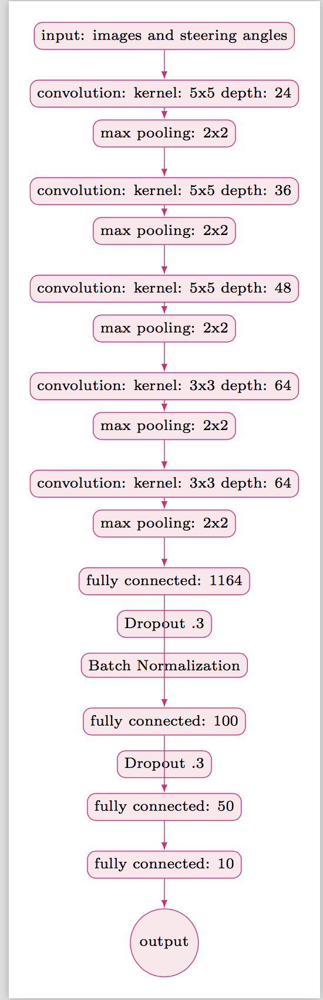
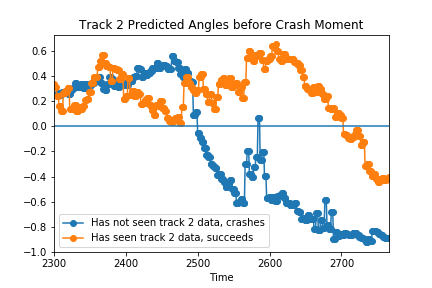
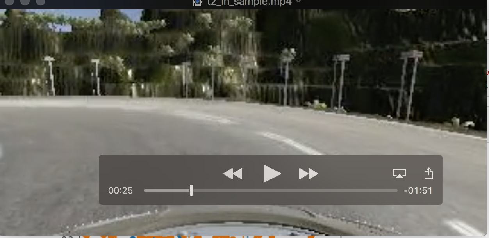
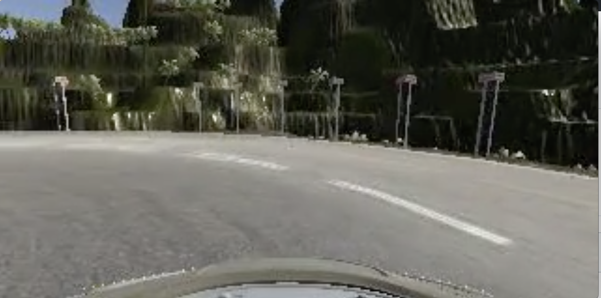

### Overview

This project aims to build a model that can predict the steering angle a human chose on a driving simulator, given the image the human saw on the screen, thereby "cloning" human behavior. The simulator provides two training tracks. A copy of Nvidia's End 2 End Neural Network architecture, trained on track 1 images can easily drive around track 1, and, as we can see from validation loss, the model can generalize to unseen track 1 images. Credit is also due to github.com/upul/Behavioral-Cloning, whose image augmentation pipeline was used.

Generalizing to track 2 images, has, so far proven more difficult. No model that has only seen track 1 images has performed better than .173 MSE on unseen track 2 images, whereas a model that has seen a few track2 images in addition to the track 1 images can achieve validation loss of .11 on **unseen** track 2 images. Similarly, a model that has trained on track 2 images can make it around track two without crashing, as shown in `videos/t2_in_sample.mp4`, whereas a model that has only been trained on track 1 data crashes at a difficult left turn, as shown in `videos/t2_oos.mp4`. Both models can easily complete track 1, as shown in `video.mp4`.

### Running the model

1) unzip tr1_data.zip or t2_train.zip
2) edit the `data_dir` variable atthe bottom of model.py to the data directory you want, e.g. `data_dir = 't2_train'`
3) find the checkpoint created with the best validation loss, eg `t1-weights-improvement-07-0.01.hdf5`
4)  `mkdir autonomous_output`
5) python drive.py `t1-weights-improvement-07-0.01.hdf5` autonomous_output
6) open the Udacity simulator, and run autonomous mode on your track
7) optionally save a video with `python video.py autonomous_output`

### Data collection

I made 10K rows of my own training data on track 1, 6k rows of training data from track 2, and used 24K rows of training data from the udacity data which are all from track 1.
When making training data, I tried to stay in the middle of road for one lap and then record a few recoveries where i moved from the extreme side of the road to the middle. This was an effort to increase data diversity, since both my and the udacity data were largely middle of the road low steering angle examples previously.

### Implementation details
All training was done for 40 epochs on an AWS g2.2xlarge instance, with the best model by validation loss saved and used in the simulator.

The Adam Optimizer was used to avoid needing to tune the learning rate.
Preprocessing code, and latex diagram builders are borrowed from github.com/upul/Behavioral-Cloning.
I also used that repo's generator skeleton code, but changed the logic to better support holding out data within a track.

### Example Training Image

### Data Augmentation Pipeline
in `generate_new_image`, from helper.py, we generate 64 augmented images.
If data comes from the left or right camera, we adjust the optimal steering angle to adjust for the discrepancy.
Then we crop the image to remove information we don't want the model to consider, like the vehicle itself or the tree line.
Then we sometimes flip the image and make the desired angle negative. This helps combat the higher number of left turns on track 1. This also combats overfitting because many of the differences between the tracks are in the (irrelevant) scenery.

The randomness means that even though we have 25000 training images, the model keeps learning new images it has never seen before, and validation accuracy continues to improve for many more than the 3 epochs of improvement that I was seeing with out the preprocessing.

### NVIDIA Architecture

After data augmentation, The `NvidiaNet` architecture in `model.py` implements the same architecture described in the Nvidia paper, 5 conv - max pooling blocks followed by 4 FC layers, but adds Dropout after the two largest Dense layers, and Batch norm after the first large dense layer to avoid overfitting and improve generalization between tracks.

### Solution Design

**Note:** When quadruples are reported like (.01, .025, .18, .11) they refer to
(train loss, validation loss on track 1 with track 1 training (6k holdout images), validation loss on track 2 with track 1 training (6k holdout images), validation loss on track 2 with track 2 training (1000 holdout images))
- All units are MSE and any loss referred to as reported "validation" loss is loss on unseen images.

My process was as follows:
1) implement nvidia architecture
- got to (.02, .04, .3, .2) after 20 epochs, succesfully made it around track 1 at 5 mph, failed at 10mph, and instantly crashed on track 2.

2) copy augmentation preprocessing code from github.com/upul/Behavioral-Cloning.
This improved results on both track 1 and track 2. We were now at something like (.011, .025, .22, .15), and could go around track 1 at any speed, and could go a bit longer around track 2 without crashing. Cropping also made training faster.

3) add Dropout and batch norm to avoid overfitting. This produced the final best results:
(.011, .013, .173, .11). In the simulator, this architecture can get around track 1 at any speed, and can get around track 2 if it has seen some track 2 data in training. It cannot get around track 2, if it only trains on track 1 data.

4) try training with median absolute error cost function, as suggested in the forums. This hurt performance a lot, what we need is more outlier sensitivity not less!

5) Try training architecture 3 for 40 epochs. (Also failed)

### Understanding the crash on track 2 for the model trained on track 1 data

In the simulator, it appears that there are two reasons the model that has seen track 2 data succeeds while the out of sample model (blue line) fails: first,  is the out of sample model starts the difficult turn closer to the left side of the road, and therefore has to make a much tighter turn than the in-sample model which starts in the middle of the road.

Second, around timestep 2550, the oos model stops turning left aggressively, wasting time that it needed to be spending turning left, as it starts doing too late, around timestep 2600.

As the the figure below shows, the oos model (blue line) actually has a much more negative steering angle before the crash. If the OOS model had been closer to the center of the road, or not gone straight briefly mid-turn, the crash would have been avoided.

### In sample model near center, facing more leftward

### OOS model closer to left of road, facing straight, about to crash

### Next Steps

I can think of a few possible ways to improve generalization between tracks:

1) generate more sharp turn on track 1 data by doing recovery laps

2) Testing different possible Dropout probabilities and configurations

3) Other image augmentation techniques that synthetically create sharp turn data

4) Post-processing that slows down the throttle if the steering angle is high.
